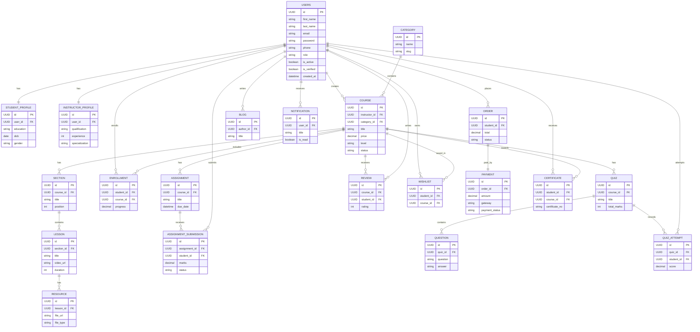

# ER Diagram

## Project Name
**Lunetron EdTech Platform**

**Version:** 1.0  
**Database:** PostgreSQL  
**ORM:** Django ORM

---

# 1. Overview

This Entity Relationship Diagram (ERD) represents the database structure of the Lunetron EdTech Platform.

Primary modules include:

- User Management
- Course Management
- Learning
- Assignments
- Quizzes
- Payments
- Certificates
- Reviews
- Notifications
- Blogs

---

# 2. Entity Relationship Diagram (Mermaid)

---

# 3. Relationship Summary

| Parent Entity | Child Entity | Relationship |
|---------------|-------------|--------------|
| User | Student Profile | 1 : 1 |
| User | Instructor Profile | 1 : 1 |
| User | Course | 1 : N |
| Category | Course | 1 : N |
| Course | Section | 1 : N |
| Section | Lesson | 1 : N |
| Lesson | Resource | 1 : N |
| User | Enrollment | 1 : N |
| Course | Enrollment | 1 : N |
| Course | Assignment | 1 : N |
| Assignment | Assignment Submission | 1 : N |
| User | Assignment Submission | 1 : N |
| Course | Quiz | 1 : N |
| Quiz | Question | 1 : N |
| Quiz | Quiz Attempt | 1 : N |
| User | Quiz Attempt | 1 : N |
| Course | Review | 1 : N |
| User | Review | 1 : N |
| User | Wishlist | 1 : N |
| Course | Wishlist | 1 : N |
| User | Order | 1 : N |
| Order | Payment | 1 : 1 |
| User | Certificate | 1 : N |
| Course | Certificate | 1 : N |
| User | Blog | 1 : N |
| User | Notification | 1 : N |

---

# 4. Design Principles

- UUID used as the primary key for all tables.
- Foreign keys enforce referential integrity.
- PostgreSQL constraints ensure data consistency.
- Indexed columns improve query performance.
- Designed for scalability with Django ORM.
- Supports Role-Based Access Control (RBAC).
- Optimized for REST API development.

---

# 5. Future Extensions

Additional entities can be introduced without major schema changes:

- Live Classes
- Chat & Messaging
- Discussion Forum
- AI Tutor Conversations
- Learning Paths
- Course Bundles
- Subscription Plans
- Organizations
- Affiliate System
- Gamification (Badges, Points, Leaderboards)

---

# Document Approval

**Prepared By:** Lunetron Development Team

**Reviewed By:** Database Architect

**Approved By:** Technical Lead

**Version:** 1.0